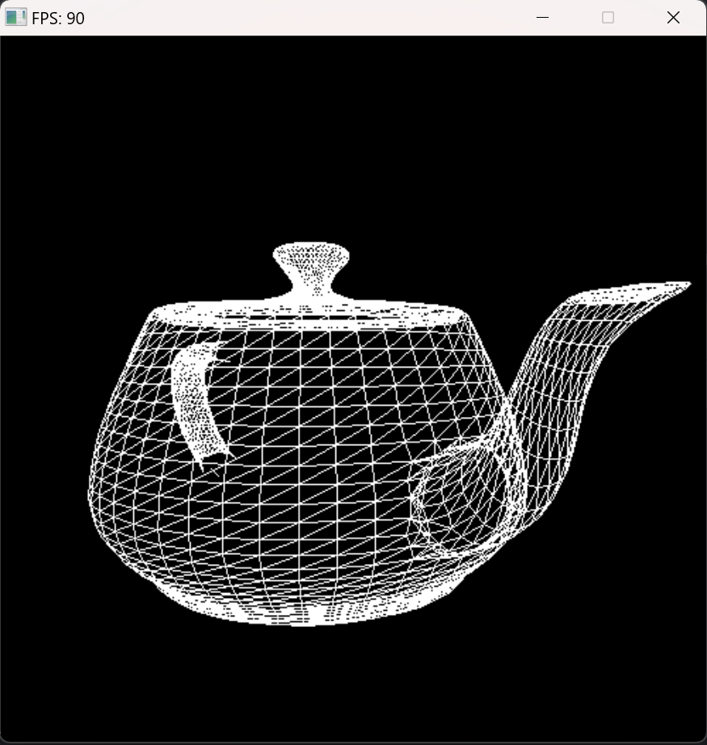
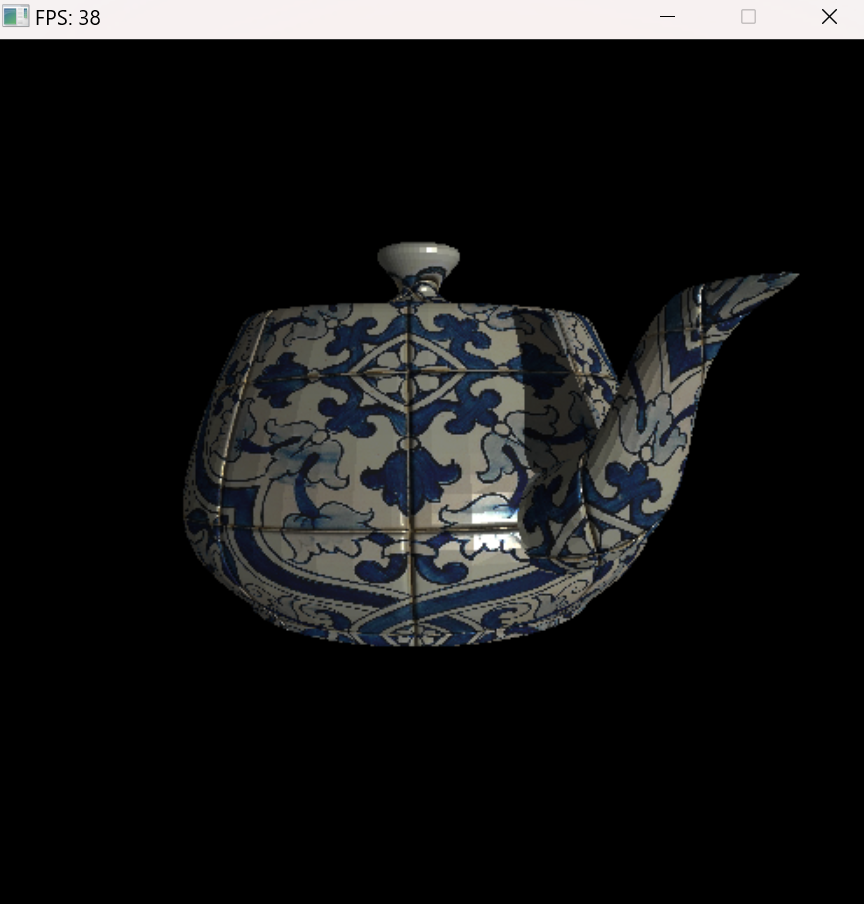
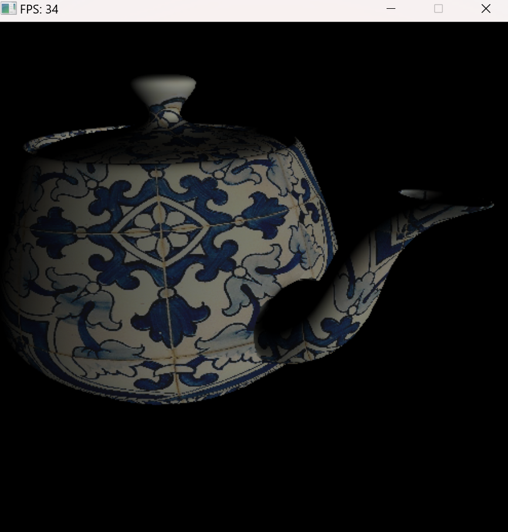

# SoftRenderer
参考OpenGL实现的一个软件渲染器，实现了以下功能：  
* 基本的渲染管线
* 简单的可交互图形界面
* 齐次裁剪
* 深度测试
* 背面剔除
* 透视插值
* 阴影贴图
* 法线贴图
* 冯氏着色和基于物理的着色
## 效果展示
### 线框模式

### 冯氏着手+阴影贴图+法线贴图

### 基于物理的着色

## 配置方法
下载源码后，目录内新建build文件夹，执行下列命令：
```
cd build
cmake -G"MinGW Makefiles" ..
cmake --build .
```
这样会在build目录下生成可执行文件，然后将libs\SDL2-2.0.20\x86_64-w64-mingw32\bin\SDL2.dll复制到可执行文件同一个目录下。
## 使用方法
直接执行cmake-build-release-mingw中的可执行文件，键位如下：  
WASD    移动摄像头  
L   线框模式  
F   冯氏着色  
P   基于物理的着色  
